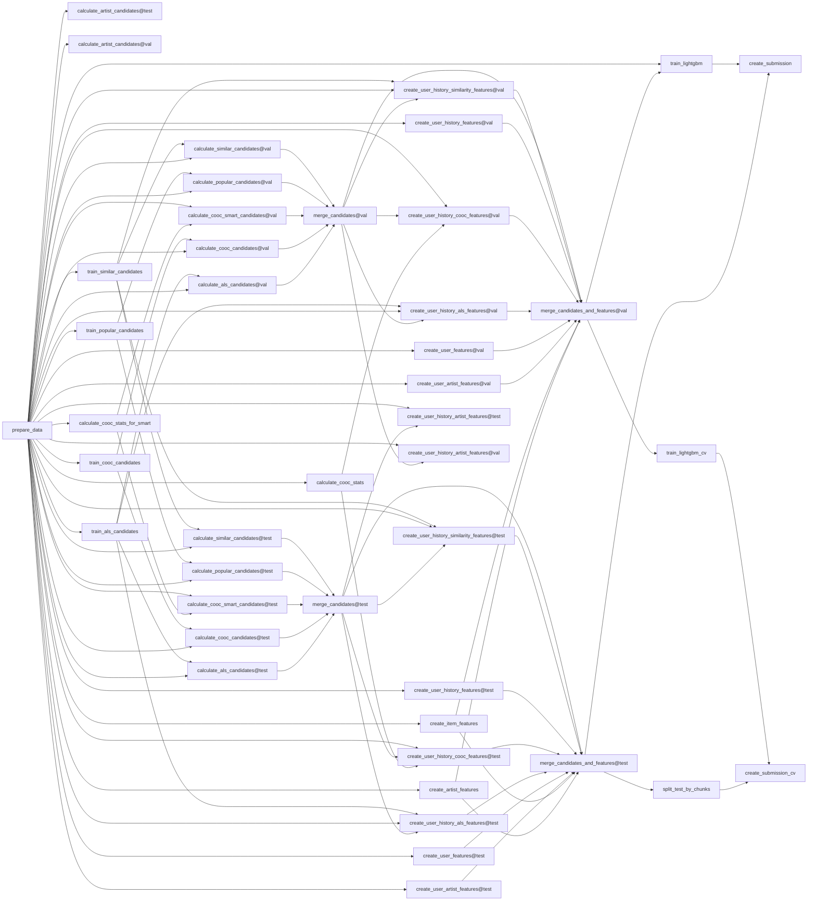

# Yandex Cup 2022: Like Prediction, 2nd place solution

This solution uses two-stage recommender system: candidate selection with different methods 
and ranking with GBDT.

## Environment and running
- if you want to use CUDF, you can install conda distribution from https://rapids.ai/start.html
- on top of it - `pip install -r requirements.txt`
- running with USE_CUDF=0 may be problematic, because there are some places where cudf-only methods like .to_pandas() are used
- to run pipeline put unzipped files to `data` and just use `dvc repro`
- to run only training&cv use `dvc repro train_lightgbm_cv`
- you can also use `dvc exp run` with different params, e.g. `dvc exp run -S train.working_dir=data/processed/sample` will run
pipeline on a small sample of data

## Hardware
All experiments were run on a rig with **512GB RAM** and **A100 GPU**.
The most memory intense step is model training, takes ~250GB RAM at peak.
GPU is only needed for fast calculation of co-occurence features with **cudf**, but it's possible to
use **pandas** instead (set env **USE_CUDF=0**).
Full pipeline with inference takes ~8 hours if executed consecutively with GPU.

## Candidate selection

### Next-item co-occurence
- calculate dictionary on all consecutive pairs in train&test data `{item: {next_item: count}}`
- get candidates as most common items in dictionary by keys - last item, pre-last, etc.

### Smart co-occurence
- get candidates by aggregated co-occurence count with last N history item (used sum)
- one thing I missed during the competition and checked after - to add weight based on rank of action in history. 
Using 1 / (rank + 1) as weight boosts recall by 10% and precision by 30% compared to evenly weighted sum.

### Implicit BM25 (Item2Item)
- train Item-Item recommender, take similar to last item as candidates
- other types of I2I from implicit also work, but BM25 is slightly better in terms of recall

### Implicit ALS
- use imlpicit ALS model for candidates. I used `recalculate_user=True`, 
but using real user factors could be a bit better

### Popular items
- since popular tracks change over time, popularity counts using only last items in user sessions

### Last artist items
- recommend top tracks of user's last liked artist

## Features
- score and rank from each candidate engine
- co-occurence aggregated stats (mean, max, std, min)
- als similarity aggregated stats
- i2i similarity aggregated stats
- item/artists statistics with different offsets (last 10, 50 actions, etc.)
- user features: number of likes, unique artists, likes per artist

## Ranker
tl;dr - **LightGBM** with **lambdarank** objective.
Some things to notice:
- 3 fold CV and averaged prediction
- downsample negative items with rate **0.3** (e.g. we keep 300k negatives from 1mln)
- use custom numba MRR implementation for early stopping
- 100 early stopping rounds, 600 iterations on average
- hyperparams were tuned on small subset of data once almost in the beginning, trying to change any of them later did not help
- learning rate: 0.04
- l1 reg: ~1
- l2 reg: ~8
- colsample: 0.6
- subsample: 0.6

## Final ensemble
Final submission is generated by blending 3 submission files
with inverse rank blend (see blend.py for exmaple).

Features and LightGBM parameters were pretty much the same between all three models.

**first** (**0.0849** lb, **0.0845** cv, **0.49** recall)
- 0 1 2 3 4 5 next item co-occurence candidates (300 per rank)
- default implicit ALS, 300 items
- last item similar candidates, 300 items
- 200 popular items
- 100 last artist top items
- LEFT JOIN CANDIDATES :D

**second** (**0.0854** lb, **0.0852** cv, **0.62** recall)
- 0 1 next item co-occurence candidates (300 per rank)
- 1500 "smart co-occurence" candidates (cooc calculated in +-7 range, use 100 last items in history)
- default implicit ALS, 300 items
- last item similar candidates, 300 items
- 200 popular items

**third** (**0.08608** lb, **0.0856** cv, **0.64** recall)
- 0 1 next item co-occurence candidates (300 per rank)
- 1500 "smart co-occurence" candidates (cooc calculated in +-7 range, use 16 last items in history)
- default implicit ALS, 300 items
- last item similar candidates, 300 items
- 200 popular items

# Bonus - DVC pipeline flow chart
